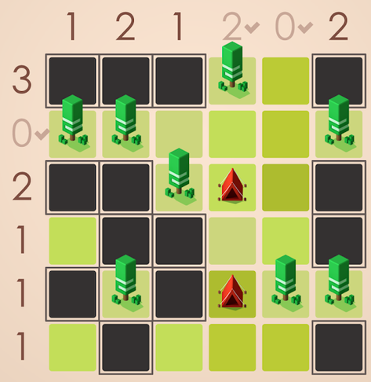
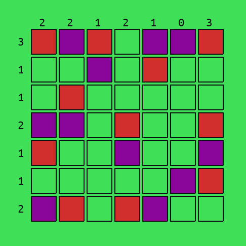

# Tents and trees solver

Solving the Tents and Trees puzzle game ([Android download](https://play.google.com/store/apps/details?id=com.frozax.tentsandtrees&hl=en_US), 
[iOS download](https://apps.apple.com/app/tents-and-trees-puzzles/id1279378379)) using a constraint satisfaction problem solver.

The goal of this puzzle is to fill the grid with tents and grass. The rules are the following:
- Each tree must have a tent next to it
- Two tents cannot touch (even in diagonal)
- Every cell that is not a tent must be grass
- Numbers on the edge of the grid specify how many tents there is on each row / column




*Original application screenshot.*




*Output example of this program. Purple = tree, red = tent, green = grass.*


## Installation

This project is using python 3.6.9, and has been tested in an Ubuntu 18.04 environment.

```
git clone https://github.com/LoicGoulefert/tentsntrees.git
cd tentsntrees
pip install -r requirements.txt
``` 


## Usage

There are 2 solvers available. The first one is a "naive" solver, and can solve the easiest (low grid dimension) problem's instances. 
The second solver is CP-SAT, the constraint satisfaction solver from Google's `ortools`. It solves all instances of the problem, 
and is only time-limited by the size of the problem's grid.

```
usage: main.py [-h] [-gd GRID_DIMENSION] [-s {naive,cpsat}]

optional arguments:
  -h, --help            show this help message and exit
  -gd GRID_DIMENSION, --grid-dimension GRID_DIMENSION
                        specify the grid dimension
  -s {naive,cpsat}, --solver {naive,cpsat}
                        specify the solver to use
```


For example, the command `python main.py --gd 10 --s cpsat` will solve and display a random 10x10 grid.
